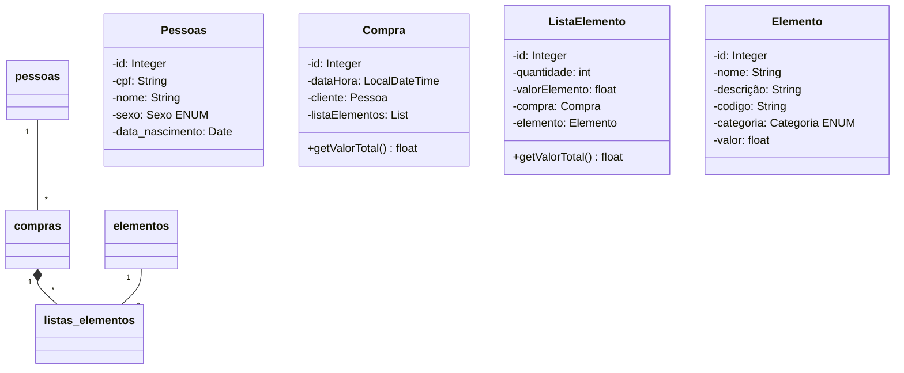

# sglc-spring-jpa
Etapa 2 - Desenvolvimento de software para Persistência
Equipe: Luis Gomes 
        Saulo Bruno
Professor: Regis Pires

```mermaid
classDiagram
    compras "1" *-- "*" listas_elementos
    elementos "1" -- "&nbsp;*" listas_elementos
    pessoas "1" -- "*" compras

class Pessoas {
    -id: Integer
    -cpf: String
    -nome: String
    -sexo: Sexo ENUM
    -data_nascimento: Date
}

class Compra {
    -id: Integer
    -dataHora: LocalDateTime
    -cliente: Pessoa
    -listaElementos: List<ListaElemento>
    +getValorTotal() float

}

class ListaElemento {
    -id: Integer
    -quantidade: int
    -valorElemento: float
    -compra: Compra
    -elemento: Elemento
    +getValorTotal() float
}

class Elemento {
    -id: Integer
    -nome: String
    -descrição: String
    -codigo: String
    -categoria: Categoria ENUM
    -valor: float
}
```
