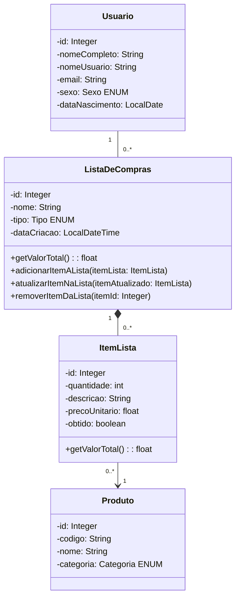

SGLC-SPRING-JPA
==================================================

Etapa 2 - Desenvolvimento de software para Persistência  
Equipe: Luis Gomes  
        Saulo Bruno       
Professor: Regis Pires  

Aplicação JPA com Spring Boot, Spring Data JPA e Spring Data Mongo.

A aplicação possui menus e sub-menus para cadastro de usuários, listas de compras, itens de lista e produtos.

Requisitos da Aplicação:

Criação de Listas: Os usuários podem criar múltiplas listas de compras, cada uma com um nome específico, como "Compras do Supermercado" ou "Material de Escritório".

Adição de Itens: Os usuários podem adicionar itens às listas de compras, incluindo informações como nome do item, quantidade desejada, preço e, opcionalmente, uma descrição. Cada item é associado a um produto.

Marcação de Itens: Os itens em uma lista podem ser marcados como adquiridos, permitindo aos usuários rastrear o que já foi comprado.

Edição e Remoção de Itens: Os usuários podem editar as informações dos itens, como quantidade, descrição, preço e também remover itens das listas.

O usuário terá um perfil contendo nome e endereço de e-mail.

